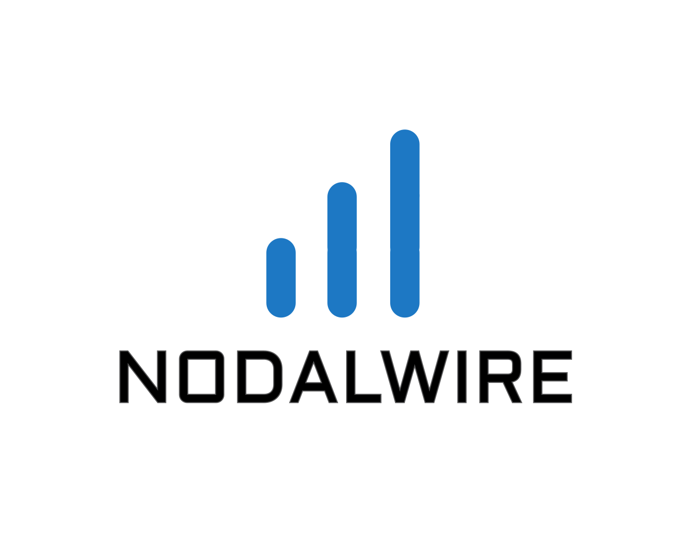

# CLAUDE.md — NodalWire Frontend Website Rules

## Always Do First
- **Invoke the `frontend-design` skill** before writing any frontend code, every session, no exceptions.

---

## Deployment

- **Live site:** https://www.nodalwire.com (hosted on Hostinger)
- **GitHub repo:** https://github.com/NodalWire/NodalWire_WebSite
- **Auto-deploy:** Hostinger is connected to the GitHub repo via hPanel → Advanced → GIT. Every `git push` to `main` automatically updates the live site within seconds. No manual file uploading needed.
- **Deploy path:** `public_html` (root of the domain)
- **Server OS:** Linux (case-sensitive paths) — always use `Brand_Assets/` with exact capitalisation. Never write `brand_assets/`.
- **Do NOT upload dev files to Hostinger:** `serve.mjs`, `screenshot.mjs`, `package.json`, `package-lock.json`, `node_modules/`, `Temp_Screenshots/`, `CLAUDE.md`, `README.md`, `GIT_COMMANDS.md` — these are local-only.

### Deployment workflow
```bash
git add -A
git commit -m "describe what changed"
git push
# Hostinger auto-deploys → site is live
```

---

## Project Direction

NodalWire is a serious network engineering and AI-driven automation company.

The website must communicate:
- Technical credibility and engineering maturity
- Operational trust and enterprise professionalism

Avoid generic dark SaaS or flashy AI startup aesthetics.

---

## Reference Images
- If a reference image is provided: match layout, spacing, typography, and color exactly. Swap in placeholder content (images via `https://placehold.co/`, generic copy). Do not improve or add to the design.
- If no reference image: design from scratch consistent with the established system below.
- Screenshot your output, compare against reference, fix mismatches, re-screenshot. Do at least 2 comparison rounds.

---

## Local Server
- **Always serve on localhost** — never screenshot a `file:///` URL.
- Start the dev server: `node serve.mjs` (serves project root at `http://localhost:3000`)
- `serve.mjs` lives in the project root. Start it in the background before taking screenshots.
- If the server is already running, do not start a second instance.

## Screenshot Workflow
- Puppeteer is installed via npm in the project root (`node_modules/puppeteer`).
- **Always screenshot from localhost:** `node screenshot.mjs http://localhost:3000`
- Screenshots save to `./Temp_Screenshots/screenshot-N.png` (auto-incremented, never overwritten).
- Optional label suffix: `node screenshot.mjs http://localhost:3000 label`
- After screenshotting, read the PNG with the Read tool to inspect it.
- Be specific when comparing: "heading is 32px but reference shows ~24px", "card gap is 16px but should be 24px"

---

## Output Defaults
- Single `index.html` file, all styles inline, unless user says otherwise
- Tailwind CSS via CDN: `<script src="https://cdn.tailwindcss.com"></script>`
- Placeholder images: `https://placehold.co/WIDTHxHEIGHT`
- Mobile-first responsive

---

## Brand Assets
- Always check the `Brand_Assets/` folder before designing. Always use `Brand_Assets/` (capital B and A) — the server is Linux and case-sensitive. Never write `brand_assets/`.
- If a logo is present, use it. If a color palette is defined, use those exact values.
- Do not use placeholders where real assets are available.

---

## Established Design System (from index.html — DO NOT DEVIATE)

### Fonts
```html
<link href="https://fonts.googleapis.com/css2?family=Lato:wght@300;400;700&family=Inter:ital,wght@0,300;0,400;0,500;1,400&display=swap" rel="stylesheet">
```
- **Lato** — headings, nav, UI labels, buttons, eyebrows
- **Inter** — body text, descriptions, form fields, captions
- Never use Space Grotesk, Arial, Roboto, or system fonts.

### Color Tokens (CSS variables on `:root`)
```css
--brand:  #1D78C4;   /* primary blue accent */
--navy:   #060e1a;   /* dark section background */
--bright: #eef4ff;   /* light text on dark backgrounds */
--muted:  #7a9bbf;   /* secondary text on dark backgrounds */
```

### Light Section Override (applied per-section via CSS scoping)
When a section uses the light off-white background, override the CSS vars on that selector:
```css
.section-name {
  background: #f4f5f1;
  --bright: #0d1a2e;
  --muted:  #486080;
}
```
This cascades automatically to all children using `var(--bright)` and `var(--muted)`.

---

## Section Background System

| Section | Background | Text |
|---|---|---|
| Nav | Transparent over hero | White |
| Hero | Dark navy + radial blue gradients | `var(--bright)` / `var(--muted)` |
| Showcase, Problem, Solutions, Why, Process, Case Study | `#f4f5f1` (off-white) | `#0d1a2e` / `#486080` |
| Free Assessment CTA | Dark navy + radial blue gradients | `#E5E7EB` |
| Footer | `#060e1a` | White |

**Rule:** The hero and footer stay dark. Content sections in the middle stay light. The final CTA section before the footer returns to dark.

---

## Navigation
- Height: `90px`
- Logo: `height: 78px; filter: brightness(0) invert(1);` (white version)
- Nav links: `font-size: 17px; color: #fff; font-family: 'Lato'`
- CTA button: `border: 1.5px solid rgba(255,255,255,0.65); color: #fff; background: rgba(255,255,255,0.07)`

---

## Hero Section — **PERMANENTLY LOCKED. DO NOT CHANGE ANYTHING.**
- Height: `70vh` / `min-height: 70vh`
- Layout: CSS grid, `grid-template-columns: 42fr 58fr; grid-template-rows: 1fr`
- Left column (42%): heading, sub, CTA button — padded `32px 48px 48px 88px`
- Right column (58%): horizontal flex accordion with 6 panels
- Accordion: collapsed panels `flex: 1`, active panel `flex: 5`, `transition: flex 0.65s cubic-bezier(0.25,0.46,0.45,0.94)`
- Panel backgrounds: `linear-gradient(158deg, #07101f 0%, #0e2a4a 55%, #144070 100%)` (each panel has slight variation)
- Panel labels: `writing-mode: vertical-lr; transform: rotate(180deg)` — vertical text, white, 15px, 0.13em tracking
- Panel content: `position: absolute; opacity: 0; transform: translateY(10px)` → active: `opacity: 1; transform: translateY(0)`
- H1: `clamp(27px, 3.36vw, 46px)`, `font-weight: 700`, `letter-spacing: -0.03em`
- Panel title: `24px`, white; panel desc: `15px`, `rgba(255,255,255,0.82)`; panel icon border: `rgba(255,255,255,0.35)`

---

## Dark Sections (Hero-style background)

Use this gradient pattern for dark sections (hero, CTA):
```css
background:
  radial-gradient(ellipse 80% 60% at 20% 50%, rgba(29,120,196,0.12) 0%, transparent 65%),
  radial-gradient(ellipse 60% 50% at 80% 30%, rgba(29,120,196,0.08) 0%, transparent 60%),
  linear-gradient(158deg, #07101f 0%, #0d2340 55%, #122e52 100%);
```

Dot grid texture (add as `::before` pseudo-element):
```css
background-image: radial-gradient(rgba(29,120,196,0.14) 1px, transparent 1px);
background-size: 28px 28px;
opacity: 0.35;
```

---

## Light Sections (Off-white content sections)

```css
background: #f4f5f1;
--bright: #0d1a2e;
--muted:  #486080;
```

Cards within light sections:
```css
background: #fff;
border: 1px solid rgba(0,0,0,0.09);
```

---

## Glass / Form Cards (used in CTA section)

```css
background: rgba(255,255,255,0.055);
backdrop-filter: blur(12px);
border: 1px solid rgba(255,255,255,0.09);
border-radius: 16px;
box-shadow: 0 4px 24px rgba(0,0,0,0.28), 0 1px 4px rgba(0,0,0,0.18), inset 0 1px 0 rgba(255,255,255,0.07);
```

Form inputs on dark glass cards:
```css
background: rgba(255,255,255,0.05);
border: 1px solid rgba(255,255,255,0.12);
color: #E5E7EB;
/* placeholder: #94A3B8 */
/* focus: border-color #1D78C4, box-shadow 0 0 0 3px rgba(29,120,196,0.14) */
```

---

## Footer
- Background: `#060e1a` (always dark, never transparent)
- Border top: `1px solid rgba(255,255,255,0.12)`
- Logo: `height: 72px; filter: brightness(0) invert(1)`
- All text: white / `rgba(255,255,255,0.7)` / `rgba(255,255,255,0.5)`
- Social icon borders: `1px solid rgba(255,255,255,0.3)`

---

## Buttons

Primary CTA (dark sections):
```css
background: linear-gradient(135deg, #1D78C4 0%, #1562a8 100%);
color: #fff;
border-radius: 9px;
box-shadow: 0 4px 16px rgba(29,120,196,0.28);
/* hover: brighter gradient + translateY(-2px) */
```

Nav CTA:
```css
border: 1.5px solid rgba(255,255,255,0.65);
color: #fff;
background: rgba(255,255,255,0.07);
```

Every clickable element needs `:hover`, `:focus-visible`, and `:active` states.

---

## Animation Rules
- Only animate `transform` and `opacity`. Never `transition-all`.
- Use spring-style easing: `cubic-bezier(0.34, 1.56, 0.64, 1)` for entrances
- Standard easing: `cubic-bezier(0.25, 0.46, 0.45, 0.94)` for accordion/layout transitions
- Stagger reveals with `animation-delay` — one well-timed entrance is better than scattered micro-interactions

---

## Anti-Generic Guardrails
- **Colors:** Never use default Tailwind palette (indigo-500, blue-600, etc.). Use `#1D78C4` and derive from it.
- **Shadows:** Never use flat `shadow-md`. Use layered, color-tinted shadows with low opacity.
- **Typography:** Lato for headings/UI, Inter for body. Never the same font for both. Tight tracking (`-0.03em`) on large headings, generous line-height (`1.7`) on body.
- **Gradients:** Layer multiple radial gradients. Add dot-grid texture for dark sections.
- **Images:** Add gradient overlay (`bg-gradient-to-t from-black/60`) and color treatment via `mix-blend-multiply`.
- **Spacing:** Use intentional, consistent spacing tokens — not arbitrary Tailwind steps.
- **Depth:** Surfaces must have layering (base → elevated → floating). Nothing sits flat at the same z-plane.

---

## Hard Rules
- **Hero section is permanently locked** — do not change any part of it under any circumstance
- Do not add sections, features, or content not in the reference
- Do not "improve" a reference design — match it
- Do not stop after one screenshot pass
- Do not use `transition-all`
- Do not use default Tailwind blue/indigo as primary color
- Do not use Space Grotesk or system fonts
- Do not make the footer background transparent — always `#060e1a`

---

## Project File Inventory

| File | Purpose | Notes |
|---|---|---|
| `index.html` | Home page | Canonical source for nav/footer; LocalBusiness + ProfessionalService JSON-LD |
| `about.html` | About NodalWire | Company story, team, values |
| `ftth.html` | FTTH Networks service page | Service JSON-LD |
| `microwave.html` | Microwave Networks service page | Service JSON-LD |
| `optical.html` | Optical Networks service page | Service JSON-LD |
| `wifi.html` | WiFi Networks service page | Service JSON-LD |
| `lab.html` | Communication Labs service page | Service JSON-LD |
| `industries.html` | Industries placeholder page | WebPage JSON-LD; 3×3 industry grid; "Coming Soon" on all cards |
| `card.html` | Digital business card (Surendran) | No nav or footer — intentional |
| `Other Pages/hummingbird_hollow_case_study.html` | Case study — Hummingbird Hollow | Article JSON-LD; BreadcrumbList |
| `sitemap.xml` | XML sitemap for search engines | 8 pages, lastmod 2026-05-10 |
| `robots.txt` | Crawler rules | Sitemap pointer, excludes node_modules/, Temp_Screenshots/, Other Pages/ |
| `serve.mjs` | Dev server | Maps `/` → `/index.html`; run via `node serve.mjs` |
| `screenshot.mjs` | Puppeteer screenshot helper | `node screenshot.mjs http://localhost:3000 [label]` |
| `.gitignore` | Git exclusions | node_modules/, Temp_Screenshots/, Other Pages/, .DS_Store, *.vcf, *.docx, fix_*.mjs |
| `Brand_Assets/` | Logo and brand files | See Brand Assets section below |

### Brand Assets folder
- `fulllogo_transparent.png` — nav and footer logo (apply `filter: brightness(0) invert(1)` for white)
- `fulllogo.jpg` — OG image (`og:image`) for social sharing
- `icononly_transparent_nobuffer.png` — favicon (tightly cropped icon, no whitespace buffer)

---

## Canonical Nav HTML

Copy this exactly when creating or updating any page. The active page should add `class="active"` to its `<li>` or `<a>`.

```html
<nav class="nav">
  <a href="/" class="nav-logo" aria-label="NodalWire home">
    
  </a>
  <ul class="nav-links">
    <li class="has-dropdown">
      <a href="#">Solutions</a>
      <ul class="nav-dropdown">
        <li><a href="microwave.html">Microwave Networks</a></li>
        <li><a href="optical.html">Optical Networks</a></li>
        <li><a href="ftth.html">FTTH Networks</a></li>
        <li><a href="wifi.html">WiFi Networks</a></li>
        <li><a href="lab.html">Communication Labs</a></li>
        <li><a href="Other Pages/hummingbird_hollow_case_study.html">Remote Property Connectivity</a></li>
      </ul>
    </li>
    <li><a href="industries.html">Industries</a></li>
    <li class="has-dropdown">
      <a href="#">Insights</a>
      <ul class="nav-dropdown">
        <li><a href="https://www.nodalwireacademy.com" target="_blank" rel="noopener">Academy</a></li>
      </ul>
    </li>
    <li><a href="about.html">About</a></li>
  </ul>
  <a href="#assessment" class="nav-cta">Talk to an Engineer</a>
</nav>
```

**Dropdown hover fix** — add this CSS to every page (fixes the 16px gap that closes the dropdown before the cursor reaches it):
```css
.nav-dropdown::before {
  content: '';
  position: absolute;
  top: -16px;
  left: 0;
  right: 0;
  height: 16px;
}
```

---

## Favicon (required on every page)

```html
<link rel="icon" type="image/png" href="Brand_Assets/icononly_transparent_nobuffer.png">
<link rel="apple-touch-icon" href="Brand_Assets/icononly_transparent_nobuffer.png">
```

Use `icononly_transparent_nobuffer.png` — the version without the whitespace buffer. The buffered version renders too small in browser tabs.

---

## SEO Block Pattern

Every page must have a full SEO block between the `<!-- ── SEO ── -->` and `<!-- ── /SEO ── -->` markers, placed in `<head>` after the title tag.

Minimum required:
- `<meta name="description">` (unique per page, 150–160 chars)
- `<link rel="canonical">`
- Open Graph: `og:type`, `og:title`, `og:description`, `og:url`, `og:image` (use `https://www.nodalwire.com/Brand_Assets/fulllogo.jpg`)
- Twitter Card: `twitter:card`, `twitter:title`, `twitter:description`, `twitter:image`
- Geo tags: `geo.region`, `geo.placename`, `geo.position`, `ICBM`
- Author meta: `<meta name="author" content="NodalWire">`
- JSON-LD schema (see below)

### JSON-LD schema by page type

| Page | Schema types |
|---|---|
| `index.html` | `LocalBusiness`, `ProfessionalService`, `WebSite` (with SearchAction) |
| Service pages (ftth, microwave, optical, wifi, lab) | `Service` + `BreadcrumbList` |
| `industries.html` | `WebPage` + `BreadcrumbList` |
| `about.html` | `AboutPage` + `BreadcrumbList` |
| Case study | `Article` + `BreadcrumbList` |

---

## Contact Form & Success Modal Pattern

Every page with an assessment/contact form must use the FormSubmit AJAX endpoint (not native POST — native POST breaks on localhost and redirects away from the page).

### Form fields (required `name` attributes)
```html
<input name="Full Name" ...>
<input name="email" type="email" ...>
<input name="Organization" ...>
<select name="Area of Interest"> <!-- or "Network Type" or "Industry" depending on context -->
```

### AJAX submission JS
```javascript
const form = document.getElementById('assessmentForm');
const modal = document.getElementById('successModal');

function val(sel) {
  const el = form.querySelector(sel);
  return el ? el.value : '';
}

form.addEventListener('submit', async function(e) {
  e.preventDefault();
  var payload = {
    'Full Name':         val('[name="Full Name"]'),
    email:               val('[name="email"]'),
    Organization:        val('[name="Organization"]'),
    'Area of Interest':  val('[name="Area of Interest"]') || val('[name="Network Type"]') || val('[name="Industry"]'),
    _subject:            'New Assessment Request — NodalWire',
    _replyto:            val('[name="email"]'),
    _autoresponse:       'Thank you for contacting NodalWire. We have received your request and a member of our team will be in touch within one business day.'
  };
  try {
    var res = await fetch('https://formsubmit.co/ajax/contact@nodalwire.com', {
      method: 'POST',
      headers: { 'Content-Type': 'application/json', Accept: 'application/json' },
      body: JSON.stringify(payload)
    });
    var json = await res.json();
    if (json.success === 'true' || json.success === true) {
      form.reset();
      modal.classList.add('open');
    }
  } catch(err) {
    console.error('Form submission error:', err);
  }
});

// Close modal
document.querySelectorAll('[data-close-modal]').forEach(function(btn) {
  btn.addEventListener('click', function() { modal.classList.remove('open'); });
});
```

### Success modal HTML
```html
<div id="successModal" class="modal-overlay">
  <div class="modal-card">
    <div class="modal-icon">✓</div>
    <h3>Message Sent</h3>
    <p>Thank you for reaching out. A NodalWire engineer will be in touch within one business day.</p>
    <button data-close-modal class="modal-close-btn">Close</button>
  </div>
</div>
```

Modal CSS (add to page `<style>`):
```css
.modal-overlay {
  display: none; position: fixed; inset: 0; z-index: 9999;
  background: rgba(0,0,0,0.6); backdrop-filter: blur(4px);
  align-items: center; justify-content: center;
}
.modal-overlay.open { display: flex; }
.modal-card {
  background: rgba(255,255,255,0.055); backdrop-filter: blur(12px);
  border: 1px solid rgba(255,255,255,0.09); border-radius: 16px;
  box-shadow: 0 4px 24px rgba(0,0,0,0.28);
  padding: 48px; text-align: center; max-width: 400px; width: 90%;
}
.modal-icon {
  width: 56px; height: 56px; border-radius: 50%;
  background: rgba(29,120,196,0.18); border: 1px solid rgba(29,120,196,0.4);
  display: flex; align-items: center; justify-content: center;
  font-size: 24px; color: #1D78C4; margin: 0 auto 20px;
}
```
